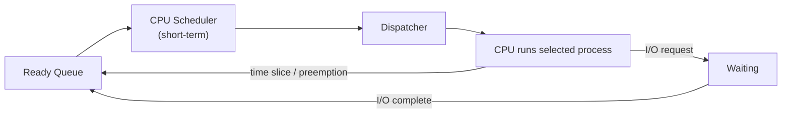
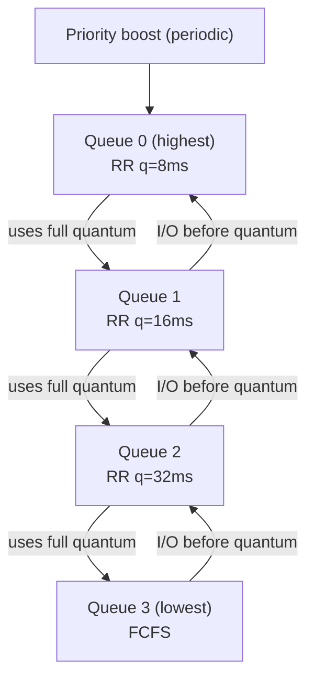

# Chapter 2: CPU Scheduling

## 2.1 What is CPU Scheduling?

**CPU Scheduling** is the process by which the OS decides which process in the ready queue gets to use the CPU next. Since we typically have more processes than CPUs, the scheduler must make smart decisions to keep the system efficient and responsive.

The component that makes this decision is called the **CPU Scheduler** or **Short-term Scheduler**. It runs whenever a scheduling decision needs to be made:

- when a process switches from Running to Waiting (like when it requests I/O)
- when a process switches from Running to Ready (when it's preempted)
- when a process switches from Waiting to Ready (when I/O completes)
- or when a process terminates

The **dispatcher** is the module that actually gives control of the CPU to the selected process. It performs the context switch, switches to user mode, and jumps to the correct location in the program. The time it takes for the dispatcher to stop one process and start another is called **dispatch latency**.



## 2.2 Scheduling Criteria

Before comparing algorithms, we need to understand what metrics we're optimizing for. Different systems prioritize different criteria, and there are inherent trade-offs between them.

- **CPU Utilization** measures the percentage of time the CPU is busy doing useful work. The goal is to keep the CPU as busy as possible, ideally between 40-90% utilization. A higher value is better, but 100% utilization might indicate the system is overloaded.
- **Throughput** measures the number of processes completed per unit time. If we complete 10 processes per second, our throughput is 10. Higher throughput is better, and this metric is particularly important for batch processing systems.
- **Turnaround Time** is the total time from when a process is submitted until it completes. The formula is: Turnaround Time = Completion Time - Arrival Time. This includes all the time spent waiting in the ready queue, executing on the CPU, and doing I/O. Lower turnaround time is better.
- **Waiting Time** is the total time a process spends waiting in the ready queue. The formula is: Waiting Time = Turnaround Time - Burst Time. This is often the metric we try to minimize because waiting time is pure overhead from the process's perspective.
- **Response Time** is the time from when a request is submitted until the first response is produced. This is critical for interactive systems where users expect immediate feedback. Lower response time is better.

The choice of scheduling algorithm depends on what you're optimizing for. A batch processing system cares about throughput and CPU utilization. An interactive desktop system prioritizes response time — users don't want to wait when they click a button. Real-time systems need predictable, bounded response times. There's no single best algorithm; it's about understanding the trade-offs.

## 2.3 Preemptive vs Non-Preemptive Scheduling

This is a fundamental distinction you must understand clearly.

In **Non-Preemptive** (also called Cooperative) scheduling, once a process gets the CPU, it keeps it until it voluntarily releases it. This release happens when the process terminates or when it requests I/O and moves to the waiting state. Non-preemptive scheduling is simpler to implement and doesn't have race conditions on shared data structures. However, the problem is that a long process can hog the CPU, starving other processes.

In **Preemptive** scheduling, the OS can forcibly take the CPU away from a running process. This typically happens on a timer interrupt when the time slice expires, or when a higher-priority process arrives. Preemptive scheduling is better for interactive systems and provides fairness among processes. The challenge is that it requires careful synchronization — what if a process is preempted while it's in the middle of updating shared data?

Modern general-purpose operating systems like Linux and Windows use preemptive scheduling. Without preemption, a buggy infinite loop would freeze the entire system. With preemption, the timer interrupt fires, and the scheduler can switch to another process. However, preemption introduces complexity — if a process is preempted while holding a lock, other processes waiting for that lock are blocked until it resumes.

## 2.4 First-Come, First-Served (FCFS)

The simplest scheduling algorithm is First-Come, First-Served. Processes are executed in the order they arrive, using a simple FIFO queue. When the CPU is free, the scheduler picks the process at the front of the queue. The process runs until it completes or blocks for I/O. FCFS is non-preemptive.

Let's work through an example. Suppose we have three processes: P1 arrives at time 0 with a burst time of 24ms, P2 arrives at time 1 with a burst time of 3ms, and P3 arrives at time 2 with a burst time of 3ms.

The execution order would be:

- P1 (0-24)
- then P2 (24-27)
- then P3 (27-30)

The waiting times are:

- P1 waits 0ms
- P2 waits 24-1=23ms
- P3 waits 27-2=25ms

The average waiting time is (0+23+25)/3 = 16ms.

```
FCFS Gantt (ms)
0          24 27 30
|---- P1 ----|P2|P3|
```

Notice the **Convoy Effect**: P2 and P3 are short processes that had to wait behind P1, a long process. This leads to poor average waiting time. If the short processes had run first, the average waiting time would be much lower.

FCFS is simple to implement and has no starvation — every process eventually runs. However, it has poor average waiting time and is not suitable for interactive systems. It works best when all processes have similar burst times.

## 2.5 Shortest Job First (SJF)

Shortest Job First selects the process with the smallest CPU burst time next. This algorithm is provably optimal for minimizing average waiting time.

There are two variants.

- **Non-Preemptive SJF** means once a process starts, it runs to completion.
- **Preemptive SJF**, also called **Shortest Remaining Time First (SRTF)**, means if a new process arrives with a shorter remaining time than the currently running process, the current process is preempted.

Let's work through a non-preemptive SJF example. We have P1 arriving at 0 with burst 7, P2 arriving at 2 with burst 4, P3 arriving at 4 with burst 1, and P4 arriving at 5 with burst 4.

At time 0, only P1 is available, so P1 runs from 0-7.

At time 7, P2, P3, and P4 are all available. The shortest is P3 with burst 1, so P3 runs from 7-8.

At time 8, P2 and P4 both have burst 4. We pick P2 (arrived first), running from 8-12.

Finally, P4 runs from 12-16.

The average waiting time with SJF is much better than FCFS. However, there's a fundamental problem: **we don't know the burst time in advance**. This is the key challenge with SJF.

The solution is prediction using **Exponential Averaging**. We predict the next burst based on previous bursts using the formula: τ(n+1) = α × t(n) + (1-α) × τ(n), where:

- τ(n+1) is the predicted next burst
- t(n) is the actual burst of the nth CPU burst
- τ(n) is the predicted value of the nth burst
- and α is a weight typically set to 0.5

SJF also has a **starvation** problem. Long processes may never run if short processes keep arriving. Despite being theoretically optimal, SJF is impractical for general-purpose systems because we can't know burst times in advance.

## 2.6 Round Robin (RR)

Round Robin is designed for time-sharing systems. Each process gets a small unit of CPU time called a **time quantum** or time slice, typically 10-100 milliseconds. After the quantum expires, the process is preempted and added to the end of the ready queue.

The algorithm maintains a circular FIFO queue.

- Each process runs for at most one quantum.
- If the process finishes before the quantum expires, it releases the CPU voluntarily.
- If the quantum expires, the process is preempted and goes to the end of the queue.

Let's work through an example with a time quantum of 4ms. We have P1 with burst 10, P2 with burst 4, and P3 with burst 3, all arriving at time 0.

P1 runs from 0-4 (remaining 6), goes to end of queue.

P2 runs from 4-8 (remaining 0), done.

P3 runs from 8-11 (remaining 0), done.

P1 runs from 11-15 (remaining 2).

P1 runs from 15-17 (remaining 0), done.

```
RR (q=4ms) Gantt (ms)
0   4   8   11  15  17
|P1|P2| P3 |P1|P1|
```

The average waiting time is (7+4+8)/3 = 6.33ms. This is higher than SJF but provides much better response time and fairness.

**Choosing the time quantum is critical**. If the quantum is too large, Round Robin degenerates to FCFS with poor response time. If the quantum is too small, there are too many context switches, and the overhead becomes significant. A good rule of thumb is that the quantum should be large enough that 80% of CPU bursts complete within one quantum.

Round Robin is the foundation of modern interactive scheduling. It ensures fairness — every process gets a turn — and provides good response time. Linux uses a variant where the quantum is dynamic based on process priority. CPU-bound processes might get longer quanta, while I/O-bound interactive processes get shorter quanta but higher priority.

## 2.7 Priority Scheduling

In Priority Scheduling, each process is assigned a priority, and the CPU is allocated to the process with the highest priority. Priorities can be defined internally based on measurable quantities like time limits, memory requirements, or I/O to CPU burst ratio. They can also be defined externally by users or administrators based on importance or payment tier.

Priority scheduling can be either preemptive or non-preemptive. In preemptive priority scheduling, a higher priority process immediately preempts the current process. In non-preemptive, the current process runs to completion even if a higher priority process arrives.

The main problem with priority scheduling is **starvation**. Low-priority processes may never execute if high-priority processes keep arriving. This is called indefinite blocking.

The solution is **aging**, which gradually increases the priority of waiting processes. A process that has been waiting for a long time eventually becomes high priority. The formula might be:

- effective_priority = base_priority + (waiting_time / aging_factor)

This guarantees that even low-priority processes will eventually run.

## 2.8 Multilevel Queue Scheduling

In Multilevel Queue Scheduling, processes are permanently assigned to different queues based on their characteristics. Each queue can have its own scheduling algorithm.

A typical structure might have a System Processes queue at the highest priority using FCFS, an Interactive Processes queue using Round Robin, and a Batch Processes queue at the lowest priority using FCFS.

Scheduling between queues can be done with fixed priority, where the higher queue must be empty before the lower queue runs. This can cause starvation of lower queues.

Alternatively, time slicing gives each queue a percentage of CPU time — for example, 80% to interactive and 20% to batch. This ensures all queues get some CPU time.

The key characteristic of multilevel queues is that a process stays in its assigned queue forever. There's no movement between queues. This is simple but inflexible — if a batch process becomes interactive, it's stuck in the batch queue.

## 2.9 Multilevel Feedback Queue (MLFQ)

The Multilevel Feedback Queue is the most sophisticated and most commonly used scheduling algorithm in modern operating systems. The key innovation is that processes can **move between queues** based on their behavior.

The core idea is elegant.

- Multiple queues exist with different priorities.
- New processes start in the highest priority queue.
- If a process uses its entire time quantum, it moves to a lower priority queue — it's probably CPU-bound.
- If a process gives up the CPU before the quantum expires (because it does I/O), it stays in the current queue or moves up — it's probably interactive.
- This automatically separates I/O-bound processes from CPU-bound processes without any prior knowledge.

A typical structure might have:

- Queue 0 at the highest priority using Round Robin with an 8ms quantum
- Queue 1 using Round Robin with a 16ms quantum
- Queue 2 using Round Robin with a 32ms quantum
- and Queue 3 at the lowest priority using FCFS



Consider how this works in practice. An interactive process enters Queue 0, runs for 2ms, does I/O, returns to Queue 0, runs for 3ms, does I/O again. It stays in the high priority queue and gets good response time. A CPU-bound process enters Queue 0, runs the full 8ms, moves to Queue 1, runs the full 16ms, moves to Queue 2, and eventually ends up in the FCFS queue. It gets lower priority but larger time slices, reducing context switch overhead.

To prevent starvation, MLFQ uses **priority boost**. Periodically, perhaps every second, all processes are moved back to Queue 0. This prevents starvation and handles processes that change behavior — a CPU-bound process that becomes interactive will get boosted back to high priority.

MLFQ is elegant because it learns process behavior without needing prior knowledge. Interactive processes naturally stay in high-priority queues because they frequently do I/O and don't use their full quantum. CPU-bound processes sink to lower queues where they get longer time slices, reducing context switch overhead. Linux's CFS (Completely Fair Scheduler) uses similar concepts.

## 2.10 Real-World Schedulers

- Linux uses the **Completely Fair Scheduler (CFS)**, which is based on the concept of virtual runtime. Each process has a virtual runtime that increases as it runs. The scheduler always picks the process with the lowest virtual runtime. This ensures fairness — processes that have run less get priority.
- Windows uses priority-based scheduling with multiple queues and dynamic priority adjustment. Interactive processes get priority boosts when they receive input, ensuring responsive UI.
- macOS uses a multilevel feedback queue variant, similar in concept to what we've discussed.

## 2.11 Common Interview Questions

**Q: Why is SJF optimal but not used in practice?**

SJF minimizes average waiting time mathematically, but we can't know burst times in advance. We can estimate using exponential averaging of past bursts, but it's still a prediction. Also, SJF causes starvation — long processes may never run. MLFQ achieves similar benefits by observing behavior rather than predicting.

**Q: What's the ideal time quantum for Round Robin?**

It depends on the workload. Too small means excessive context switches; too large degenerates to FCFS. A good heuristic is that 80% of CPU bursts should complete within one quantum. Typically 10-100ms. Modern systems often use dynamic quanta based on process type.

**Q: How does aging solve starvation?**

Aging gradually increases a process's priority based on how long it has been waiting. Even a low-priority process will eventually have its priority boosted high enough to run. It's a simple formula: effective_priority = base_priority + f(waiting_time).

**Q: Explain the difference between preemptive and non-preemptive scheduling.**

In non-preemptive scheduling, once a process gets the CPU, it keeps it until it voluntarily releases — either by terminating or blocking for I/O. In preemptive scheduling, the OS can forcibly take the CPU away, typically on a timer interrupt. Preemption enables fairness and responsiveness but requires careful handling of shared resources.

## Key Takeaways

- CPU scheduling is about making smart decisions on which process runs next, balancing multiple competing criteria. You can't optimize all metrics simultaneously — there are inherent trade-offs between throughput, response time, and fairness.
- FCFS is simple but suffers from the convoy effect where short processes wait behind long ones. SJF is theoretically optimal for average waiting time but impractical because we can't know burst times in advance, and it causes starvation.
- Round Robin provides fairness and good response time, making it suitable for interactive systems. The time quantum is critical — too large becomes FCFS, too small causes excessive context switching.
- Priority scheduling is intuitive but needs aging to prevent starvation. MLFQ is the most sophisticated approach, automatically learning process behavior and adapting priorities accordingly. It's the foundation of modern OS schedulers.
- Understanding these algorithms and their trade-offs helps you reason about system behavior and make informed decisions when designing concurrent systems.
